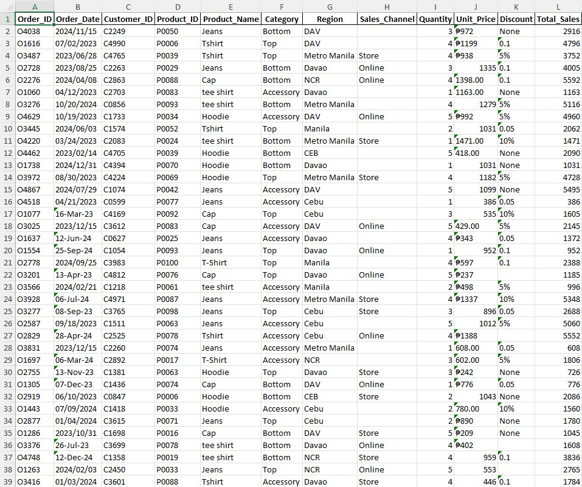
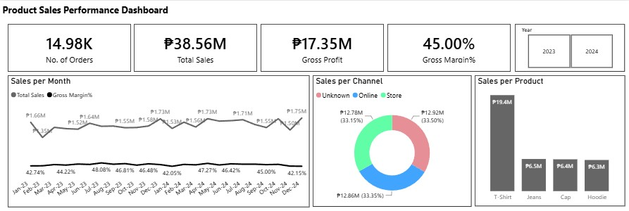
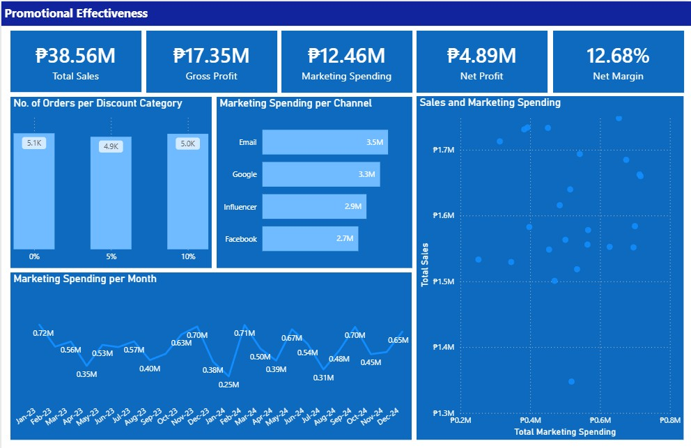

# 👕StyleHub: Unlocking Profit Growth Opportunities
## 📄Project Overview
###
This project analyzes the performance of StyleHub, a retail apparel company, focusing on key drivers of profitability. The dashboard evaluates product performance and promotional effectiveness impact using metrics such as sales, cost, discounts, marketing spend, and profit.

Results show that StyleHub maintains stable gross margins and strong net profitability. However, discounts and marketing expenses reduce overall profit, highlighting opportunities for optimization.

The dashboard enables interactive analysis across time, regions, products, and sales channels, supporting data-driven decisions. It is designed to help improve pricing strategies, optimize marketing efficiency, and minimize return-related losses.

Overall, StyleHub demonstrates solid performance with clear potential for further margin improvement through operational enhancements.

## ⚠️Problem Statement
###
StyleHub’s net profit margin is 12%, with profitability impacted by high discounts and marketing spend, limiting its potential to reach a 15% target.

## 📊Data Summary
###
**Period:** Jan 2023 – Dec 2024 (Jan 2025 excluded due to low volume)

**Scope:** Retail apparel transactions across regions and sales channels

**Volume:** Multi-month sales and profit records

**Attributes:** Order details, product/category, region, sales channel, pricing, discounts, costs, marketing spend, profit, and gross margin

## ⚙️Tools and Methodology
###
**Microsoft Excel** – Data cleaning, data standardization, and exploratory data analysis (EDA)

**Power BI** – Dashboard development, data modeling, and DAX-based measures for interactive reporting

## 💡Insights
###

1️⃣ **Seasonal Demand & Revenue Volatility**

Sales and profit follow clear seasonal demand patterns, driving periodic peaks and dips in performance. This indicates strong reliance on cyclical buying behavior, highlighting opportunities for demand smoothing and strategic campaign timing during low-performing periods.

2️⃣ **Strong Pricing Power & Margin Stability**

Gross margins remain consistently strong (~45–50%), indicating effective pricing strategy and cost control. This suggests that core product profitability is not a concern, and the business maintains solid value capture from its offerings.

3️⃣ **Promotion Inefficiency & Profit Erosion**

Promotional activities, particularly discounts and marketing spend, are not translating proportionally into profit growth. Instead, they are compressing margins and reducing overall profitability, indicating inefficiencies in targeting, execution, or ROI measurement.

## 📌Strategic Recommendations
###
1️⃣ **Demand Stabilization Through Best-Seller Replication**

Standardize high-performing product, pricing, and channel combinations during peak months and replicate these strategies in low-performing periods to reduce revenue volatility and improve baseline performance.

2️⃣ **Seasonal Revenue Maximization Strategy**

Capitalize on peak demand cycles by aligning inventory, pricing, and marketing campaigns ahead of high-performing months to maximize sales uplift and margin capture during periods of strong consumer demand.

3️⃣ **Promotion Optimization & Discount Rationalization**

Shift away from broad discounting strategies toward targeted, data-driven promotions. Replace blanket discounts with personalized offers, bundles, or value-based incentives to protect margins while sustaining conversion rates.

4️⃣ **Marketing ROI Optimization Framework**

Implement performance tracking across marketing channels to identify high-ROI campaigns and reallocate budget toward top-performing segments, improving overall efficiency and profitability.

## ✅Conclusion
###

This analysis shows that StyleHub’s pricing strategy is effective, as reflected in its strong gross margins. However, the main issue lies in its marketing spend, which appears to be inefficient and does not translate into meaningful returns. To improve performance and move toward top-tier competitors, StyleHub should focus on scaling strategies that are already proven to work, plan campaigns more proactively around demand cycles, optimize promotional activities, and reallocate marketing spend toward channels and initiatives that generate measurable impact.
